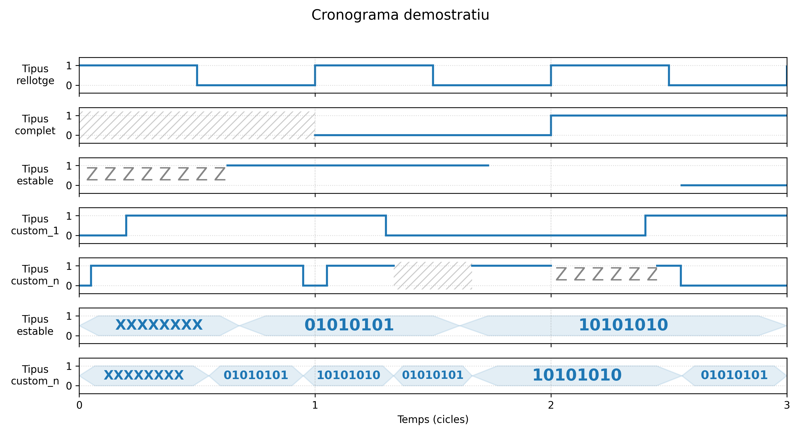

# Creador de Cronogrames Digitals

Generador de cronogrames digitals parametritzable útil per a il·lustrar exàmens, apunts o documentació tècnica de **Sistemes Digitals**.

El programa genera una imatge amb línies digitals (0/1), indeterminacions (X), alta impedància (Z), intervals sense valor (B), i un rellotge mestre que defineix el ritme i les línies de referència verticals.

Permet crear cronogrames complexos de forma ràpida i automàtica a partir de paràmetres donats per línia de comandes.



## Característiques principals

- ✔ Generació d’un o més senyals digitals al llarg d’un nombre arbitrari de cicles  
- ✔ Un **rellotge mestre** obligatori que marca els flancs de pujada  
- ✔ Suport per quatre tipus de senyal:
  - **rellotge** → 50% de duty (primera meitat alt, segona baix)
  - **estable** → transicions al·leatòriament entre 0.2 i 0.5 cicles abans del flanc de pujada
  - **complet** → canvis exactes a cada inici de cicle
  - **custom** → transicions definides manualment (per exemple "0.25;0.5;0.75" per transicions a un quart, mig i tres quarts de cicle)
- ✔ Suport per valors especials:
  - **0 / 1** → valors digitals estàndard
  - **X** → indeterminació (patró diagonal)
  - **Z** → alta impedància (patró textual repetit “Z Z Z Z …”)
  - **B** → sense valor (no es pinta res)
- ✔ Representació visual clara i coherent
- ✔ Línies verticals puntejades en tots els senyals a cada **flanc de pujada** del rellotge mestre
- ✔ El cronograma abasta **exactament t = 0 fins t = cicles**
- ✔ Exportació opcional a PNG

## Exemple d'ús

```
python3 programa.py   --titol "Cronograma EP/SP"   --cicles 5   --nom "Clk" --tipus rellotge   --nom "D[2]" --tipus estable --valors 0X1Z1   --nom "D[1]" --tipus estable --valors 11B10   --nom "D[0]" --tipus estable --valors 1X1Z0   --sortida sortida.png
```

## Creació d'entorn virtual amb biblioteques

```
python3 -m venv venv
source venv/bin/activate
pip install matplotlib numpy
```

## Execució

```
python3 programa.py --titol "Demo" --cicles 4 --nom Clk --tipus rellotge
```

## Autor

**Angel Galindo Muñoz + Copilot**  
Febrer 2026

